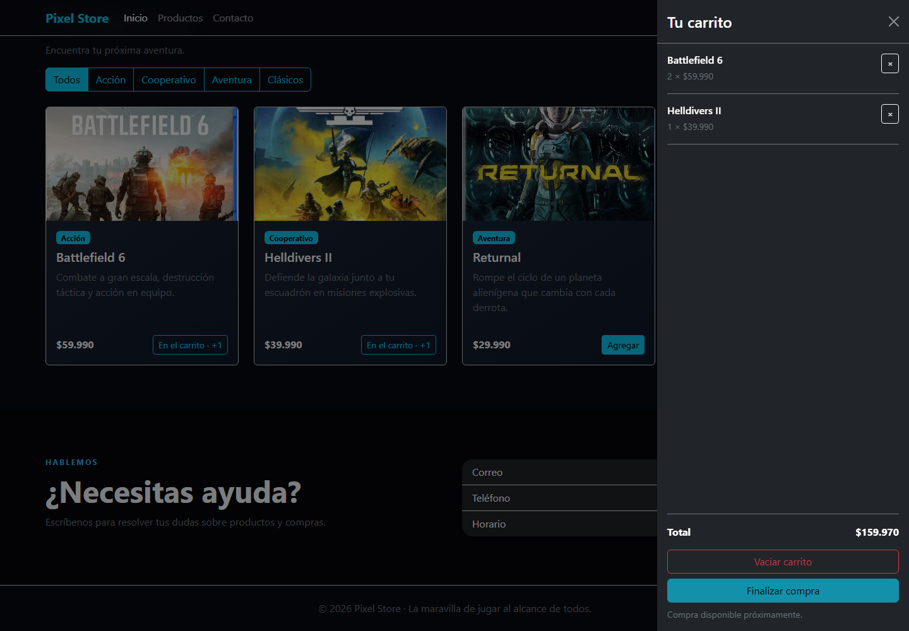
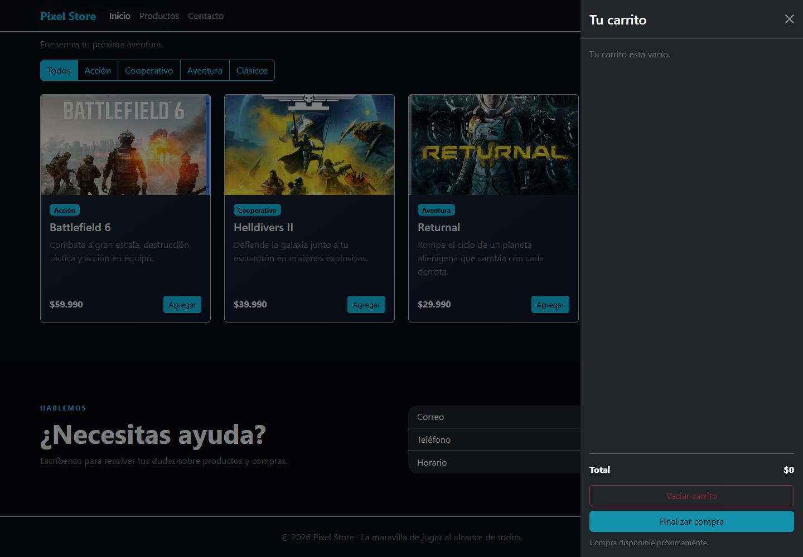

# Evidencias Semana 8

## Pixel Store

**Actividad:** Mejorando funcionalidades clave en el eCommerce con React.

**Asignatura:** Desarrollo Frontend I · PFY2201.

**Estudiante:** Juan Carlos Osega.

**Fecha de revisión:** 5 de octubre de 2026.

**Estado:** código y aplicación React publicados; funcionamiento verificado en el sitio público. Pendiente únicamente la captura de configuración de Pages para completar las evidencias.

### Actualización del entregable anterior

El informe anterior, ubicado en `Frontend/Actividad/Juan_Osega_PFY2201_Evidencias_Semana6.pdf`, documentaba una aplicación con JavaScript y nueve capturas: inicio, catálogo, filtros, búsqueda, carrito, vista móvil y publicación. Esta versión acredita la gestión de estados, efectos y renderizado condicional de Semana 8 y conserva la identidad visual de la tienda.

Se mantiene el informe de Semana 6 como antecedente. Sus capturas de publicación no acreditan el despliegue de la versión React.

### Resultado de la verificación

- Compilación de producción completada mediante `npm run build`.
- Tres pruebas funcionales aprobadas localmente y en el sitio publicado mediante `npm test`.
- Auditoría de dependencias sin vulnerabilidades reportadas mediante `npm audit`.
- Dos capturas funcionales actuales incluidas en este informe.

Las capturas incluidas se actualizaron desde el sitio público. La evaluación CL también requiere revisar el código y el funcionamiento de la aplicación publicada.

---

# Correspondencia con la pauta

### 1. Gestión de estados · 25 puntos

`src/App.jsx` administra con `useState` el catálogo (`productos`), el carrito (`carrito`), la búsqueda, la categoría seleccionada, la carga, los errores y el reintento. Las actualizaciones del carrito crean nuevos objetos y arreglos, sin modificar el estado anterior. El contador suma las unidades y el total considera precio por cantidad.

### 2. Manejo de efectos · 20 puntos

`useEffect` carga `assets/data/productos.json` mediante `fetch`, valida la respuesta y actualiza el catálogo. El efecto depende del estado de reintento. La función de limpieza cancela la solicitud pendiente con `AbortController`. La carga y los errores tienen mensajes visibles.

### 3. Renderizado condicional · 20 puntos

`src/components/Producto.jsx` cambia el botón de «Agregar» a «En el carrito · +1». `src/components/Carrito.jsx` muestra el mensaje de carrito vacío o los productos seleccionados y deshabilita el vaciado cuando no hay productos. El catálogo muestra mensajes de carga, error y búsqueda sin resultados según el estado.

### 4. Organización y claridad · 15 puntos

`src/main.jsx` inicia la aplicación. `App.jsx` concentra los estados compartidos y comunica datos y acciones mediante props. Los componentes reutilizables de producto y carrito separan la presentación. Los estilos, imágenes y datos mantienen carpetas propias. Los comentarios son breves, precisos y explican la lógica sin referencias a entidades. La navegación, el carrusel, los colores y las imágenes conservan el estilo anterior.

### 5. Publicación · 20 puntos

La compilación genera `dist` con rutas relativas. El código actualizado se publicó en `exp3-s8` y `npm run deploy` publicó el sitio en `gh-pages`. El despliegue terminó correctamente y tres pruebas funcionales pasaron en la URL pública. Falta adjuntar la captura de configuración de Pages como evidencia complementaria de este criterio.

---

# Evidencia 1 · Catálogo y carrito

El catálogo muestra productos cargados desde JSON. Se agregaron dos unidades de Battlefield 6 y una de Helldivers II. El carrito presenta cantidades, eliminación y un total de $159.970. Los botones de los productos seleccionados cambian a «En el carrito · +1».

La prueba comprueba además el contador de tres unidades. Después de eliminar Battlefield 6, comprueba una unidad y un total de $39.990.

**Criterios relacionados:** gestión de estados, carga dinámica y renderizado condicional. La utilización de los hooks se acredita mediante el código señalado en la página anterior.

**Origen:** sitio público https://jotaxiii.github.io/Frontend-1/. La captura funcional se complementa con el enlace del sitio y la evidencia de configuración de Pages.

---

# Evidencia 2 · Carrito vacío

Después de eliminar un producto y vaciar el carrito, aparece «Tu carrito está vacío», el total vuelve a $0 y «Vaciar carrito» queda deshabilitado. Los botones del catálogo vuelven a «Agregar».

La prueba comprueba además que el contador vuelve a cero. La comparación con la evidencia anterior muestra la actualización de la interfaz según el estado.

**Criterios relacionados:** gestión del carrito y renderizado condicional de mensajes y botones.

**Origen:** sitio público https://jotaxiii.github.io/Frontend-1/.

---

# Publicación y entrega

### Enlaces

**Código fuente publicado:** https://github.com/JotaXIII/Frontend-1/tree/exp3-s8

**Rama de código actual:** `exp3-s8`, publicada y disponible para revisión.

**Rama de despliegue:** `gh-pages`.

**Sitio publicado y verificado:** https://jotaxiii.github.io/Frontend-1/

**Despliegue verificado:** https://github.com/JotaXIII/Frontend-1/actions/runs/37400556241

El despliegue finalizó con resultado satisfactorio. Se comprobó la versión React publicada, la carga de imágenes y productos, los cálculos del carrito, la eliminación, los filtros, la vista móvil y el reintento tras un error simulado.

### Mínimo de capturas propuesto: tres

1. Catálogo con el carrito abierto y productos agregados: cantidades, total y al menos un botón «En el carrito · +1». Incluida como evidencia 1.
2. Carrito después de eliminar los productos: mensaje de vacío, total $0 y botones «Agregar». Incluida como evidencia 2.
3. Configuración de Pages después de publicar: mensaje de sitio disponible, URL, rama `gh-pages` y carpeta raíz. Pendiente.

No se necesitan capturas adicionales de inicio, filtros, búsqueda, diseño móvil o errores para cubrir los entregables explícitos. Las dos primeras ya corresponden al sitio publicado. Si las tomas nuevamente, incluye la barra de direcciones para identificar la versión desplegada.

Las tres capturas complementan el código y los enlaces; no sustituyen una publicación funcional ni garantizan por sí solas una calificación CL.

### Pendientes antes de entregar

- Agregar la tercera captura, con el sitio disponible, su URL y la rama `gh-pages` visibles en la configuración de Pages.
- Entregar en AVA el PDF actualizado, el enlace a la rama `exp3-s8` y el enlace al sitio publicado.

### Archivos de apoyo

`README.md` contiene la estructura, los requisitos y los comandos de ejecución, compilación, pruebas y publicación. `tests/tienda.spec.js` verifica el carrito, los filtros, la vista móvil y el reintento después de un error.

El informe puede regenerarse con `python scripts/generar_evidencias.py`. Requiere el paquete `reportlab`.
